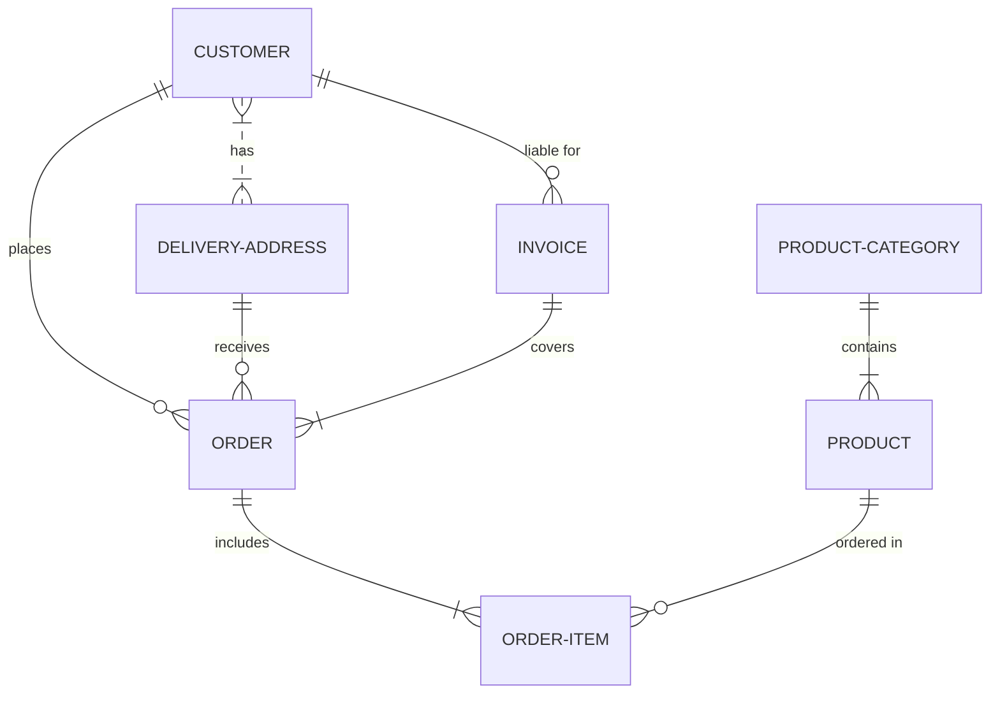

# GK Innovatech
    

# Gestión de Ventas - GK Innovatech

**Asignatura**: Bases de Datos I (FaCENA-UNNE)

**Integrantes**:
 - Acosta, Lopez Gonzalo Nahuel.
 - Borda, Esteban Rubén.
 - Garay, Kevin Emiliano.
 - Mancedo Joaquin.

**Año**: 2024

## CAPÍTULO I: INTRODUCCIÓN

### Caso de estudio

#### 1.1 -	Tema

Implementación, Análisis y Optimización de la Base de Datos para un Sistema de Gestión de Ventas de Productos Electrónicos en GK Innovatech: Mejorando la Eficiencia e Integridad de Datos.

#### 1.2 - Alcance
En este proyecto de estudio se trabajará exclusivamente con el sistema de las ventas y el control del stock, quedará exento de esto las compras de productos, los permisos de los usuarios siendo estos los vendedores  y la modificación o eliminación de los proveedores

### Definición o planteamiento del problema

Este proyecto de estudio investiga la base de datos del sistema de gestión de ventas de GK Innovatech, una empresa de artículos electrónicos. El objetivo es identificar y resolver problemas relacionados con la eficiencia operativa, la integridad de los datos y la experiencia del usuario. 

Se busca optimizar la estructura y el rendimiento de la base de datos para garantizar un manejo eficiente de la información de ventas, inventario y clientes, contribuyendo así a una mejor toma de decisiones y satisfacción del cliente.

i. Objetivo General
    Optimizar la base de datos del sistema de gestión de ventas de GK Innovatech para mejorar la eficiencia, la integridad de los datos.
ii. Objetivos Específicos
    Identificar los problemas actuales de la base de datos en el sistema de gestión de ventas, incluyendo problemas en el rendimiento, inconsistencias en la integridad de los datos. 
        Este objetivo se centra en diagnosticar las áreas problemáticas para establecer un punto de partida claro.
    Analizar y proponer mejoras en la estructura de la base de datos que optimicen la velocidad de consulta y la eficiencia en la gestión de datos.
        Aquí se busca encontrar soluciones técnicas que mejoren el rendimiento del sistema.
    Implementar técnicas de normalización y mejores prácticas de diseño de bases de datos para asegurar la integridad y consistencia de los datos de ventas e inventario.
        Este objetivo se enfoca en garantizar la calidad y fiabilidad de los datos.

## CAPITULO II: MARCO CONCEPTUAL O REFERENCIAL

**TEMA 1 " ---- "** 
Ut sed imperdiet risus. Maecenas vestibulum arcu vitae orci pretium pharetra. Suspendisse potenti. Fusce massa libero, fermentum eget elit in, tincidunt fermentum nunc. Cras imperdiet nisl elit, elementum gravida enim accumsan vel. Sed in sapien quis ante consectetur commodo id non nulla. Aenean lacinia, dolor convallis semper mattis, ante orci elementum nunc, eget feugiat risus neque in urna. Ut ut quam nec risus mollis convallis ornare ac odio. Phasellus efficitur posuere nibh, eget tempor augue pellentesque ac. Ut enim sem, imperdiet non est ut, blandit posuere dui. Curabitur at purus orci. Interdum et malesuada fames ac ante ipsum primis in faucibus.

**TEMA 2 " ----- "** 
Ut sed imperdiet risus. Maecenas vestibulum arcu vitae orci pretium pharetra. Suspendisse potenti. Fusce massa libero, fermentum eget elit in, tincidunt fermentum nunc. Cras imperdiet nisl elit, elementum gravida enim accumsan vel. Sed in sapien quis ante consectetur commodo id non nulla. Aenean lacinia, dolor convallis semper mattis, ante orci elementum nunc, eget feugiat risus neque in urna. Ut ut quam nec risus mollis convallis ornare ac odio. Phasellus efficitur posuere nibh, eget tempor augue pellentesque ac. Ut enim sem, imperdiet non est ut, blandit posuere dui. Curabitur at purus orci. Interdum et malesuada fames ac ante ipsum primis in faucibus.

...

## CAPÍTULO III: METODOLOGÍA SEGUIDA 

Donec lobortis tincidunt erat, non egestas mi volutpat in. Cras ante purus, luctus sed fringilla non, ullamcorper at eros.

 **a) Cómo se realizó el Trabajo Práctico**
Vestibulum rutrum feugiat molestie. Nunc id varius augue. Ut augue mauris, venenatis et lacus ut, mattis blandit urna. Fusce lobortis, quam non vehicula scelerisque, nisi enim ultrices diam, ac tristique libero ex nec orci.

 **b) Herramientas (Instrumentos y procedimientos)**
Donec lobortis tincidunt erat, non egestas mi volutpat in. Cras ante purus, luctus sed fringilla non, ullamcorper at eros. Integer interdum id orci id rutrum. Curabitur facilisis lorem sed metus interdum accumsan. 

## CAPÍTULO IV: DESARROLLO DEL TEMA / PRESENTACIÓN DE RESULTADOS 

Maecenas molestie lacus tincidunt, placerat dolor et, ullamcorper erat. Mauris tortor nisl, ultricies ac scelerisque nec, feugiat in nibh. Pellentesque interdum aliquam magna sit amet rutrum. 

### Diagrama conceptual (opcional)
Ejemplo usando Live Editor https://mermaid.js.org/ (ejemplo opcional)

### Diagrama relacional
 

### Diccionario de datos

Acceso al documento [PDF](doc/diccionario_datos.pdf) del diccionario de datos.

### Desarrollo TEMA 1 "----"

Fusce auctor finibus lectus, in aliquam orci fermentum id. Fusce sagittis lacus ante, et sodales eros porta interdum. Donec sed lacus et eros condimentum posuere. 

> Acceder a la siguiente carpeta para la descripción completa del tema [scripts-> tema_1](script/tema01_nombre_tema)

### Desarrollo TEMA 2 "----"

Proin aliquet mauris id ex venenatis, eget fermentum lectus malesuada. Maecenas a purus arcu. Etiam pellentesque tempor dictum. 

> Acceder a la siguiente carpeta para la descripción completa del tema [scripts-> tema_2](script/tema02_nombre_tema)

... 

## CAPÍTULO V: CONCLUSIONES

Nunc sollicitudin purus quis ante sodales luctus. Proin a scelerisque libero, vitae pharetra lacus. Nunc finibus, tellus et dictum semper, nisi sem accumsan ligula, et euismod quam ex a tellus. 

## BIBLIOGRAFÍA DE CONSULTA

 1. List item
 2. List item
 3. List item
 4. List item
 5. List item

